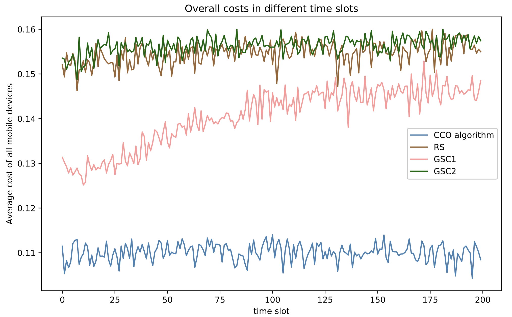
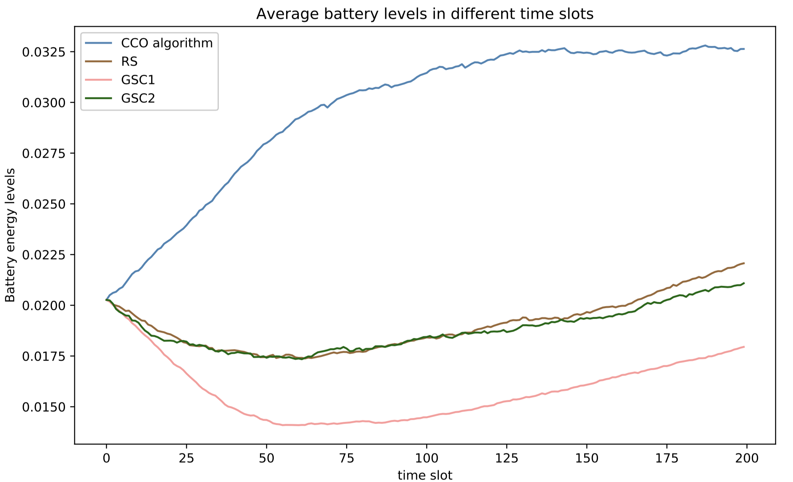

# Cross-edge Computation Offloading

A python package of Cross-edge Computation Offloading (CCO) algorithm and its distributed version, Decor for 
Mobile Edge Computing (MEC). 

This package is an implementation of the proposed offloading algorithm for mobility-aware computation-intensive partitionable applications. Specifically, for a non-convex 
edge site-selection sub-problem, we propose a Sampling-and-Classification-based (SAC) algorithm to obtain the 
near optimal solution. CCO algorithm is an online algorithm based on Lyapunov optimization is proposed to 
jointly determine edge site-selection and energy harvesting without a priori knowledge. The transmission, 
execution and coordination cost, as well as the penalty for task failure, are chosen as performace metrics. 

**Citation**:
> [Leave empty temporarily.]

**Used dataset**:
> EUA dataset @ https://github.com/swinedge/eua-dataset/.

**Referenced Code**:
> RACOS @ https://github.com/eyounx/RACOS.

## Quick Start
### A simple example
[Leave empty temporarily.]

### Results

